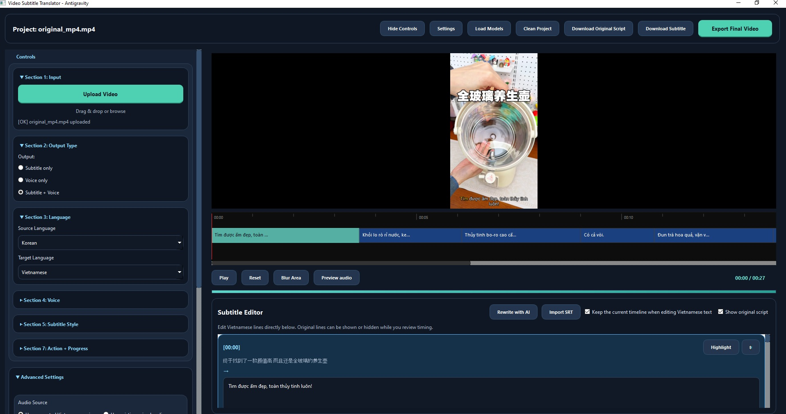

# CapCap

Language: [Tiếng Việt](#tiếng-việt) | [English](#english)



## Tiếng Việt

CapCap là desktop app chạy local trên Windows để Việt hóa video: tách audio, nhận diện giọng nói, dịch phụ đề, chỉnh sửa subtitle, tạo voice tiếng Việt, preview và export trong một workflow thống nhất.

### Quick Start

```bash
git clone https://github.com/notepower2k1/CapCap.git
cd CapCap
pip install -r requirements.txt
python ui/gui.py
```

Build release:

```bash
python -m PyInstaller D:\CodingTime\CapCap\CapCap.spec --noconfirm --clean
```

### Mục tiêu

1. chọn video nguồn
2. extract audio
3. nhận diện lời nói
4. dịch sang tiếng Việt
5. chỉnh và polish subtitle
6. tạo voice tiếng Việt hoặc dùng audio có sẵn
7. preview subtitle và audio
8. export video hoàn chỉnh

### Tính năng chính

- workflow theo project, có thể resume
- hỗ trợ `subtitle only`, `voice only`, `subtitle + voice`
- transcribe bằng `faster-whisper`
- dịch cơ bản bằng Google web fallback hoặc Microsoft Translator khi có cấu hình
- AI polish/rewrite bằng local LLM hoặc OpenRouter khi có cấu hình
- subtitle editor tích hợp trong app
- preview frame, preview 5 giây, preview audio
- generate voice bằng `Edge TTS` hoặc `Piper`
- mix voice và background audio bằng `FFmpeg`
- render subtitle bằng ASS
- export video hoàn chỉnh trong app
- build release/debug bằng `PyInstaller`

### Kỹ thuật sử dụng

- `PySide6` cho desktop UI
- kiến trúc `ui -> controllers -> services -> workflows -> engines`
- `QThread` cho background worker
- `faster-whisper` cho speech-to-text local
- `onnxruntime` gián tiếp qua `faster-whisper` và `piper`
- `Demucs` cho vocal/background separation
- `FFmpeg` cho extract audio, convert, mix, mux, export
- `libmpv` qua `python-mpv` cho preview video/audio
- `Piper TTS` cho local Vietnamese voice
- `edge-tts` cho cloud TTS miễn phí
- `llama-cpp-python` cho local AI polish/rewrite
- `requests` cho translator/API integration
- `PyInstaller` để đóng gói Windows app
- project-state persistence để resume workflow
- subtitle styling bằng `SRT -> ASS`

### Cài đặt

```bash
git clone https://github.com/notepower2k1/CapCap.git
cd CapCap
pip install -r requirements.txt
```

Tạo `.env` từ [D:\CodingTime\CapCap\.env_example](D:/CodingTime/CapCap/.env_example) nếu cần cấu hình translator hoặc AI provider.

### Chạy từ source

```bash
python ui/gui.py
```

Hoặc:

```bash
python ui/main_window.py
```

### Build

Release:

```bash
python -m PyInstaller D:\CodingTime\CapCap\CapCap.spec --noconfirm --clean
```

Debug:

```bash
python -m PyInstaller D:\CodingTime\CapCap\CapCap.debug.spec --noconfirm --clean
```

Ghi chú:

- release chỉ bundle `voice_preview_catalog.release.json` dưới tên `app/voice_preview_catalog.json`
- release chỉ bundle 1 local voice mặc định: `vi_VN-vais1000-medium`
- các local voice khác người dùng tự tải vào `models/piper`
- debug build giữ console để kiểm tra runtime khi cần

### Giới hạn hiện tại

- tối ưu cho Windows
- cần Internet nếu phải tải model hoặc dùng translator/TTS online
- release không bundle toàn bộ local Piper voices
- một số bước AI hoặc stem separation có thể chậm trên máy yếu hoặc khi chạy CPU
- chất lượng subtitle, translation và voice còn phụ thuộc model, dữ liệu đầu vào và cấu hình máy

### Troubleshooting

- `FFmpeg not found`:
  - kiểm tra `bin/ffmpeg/ffmpeg.exe` và `ffprobe.exe`
- local voice báo không tồn tại:
  - kiểm tra file `.onnx` và `.onnx.json` trong `models/piper`
  - release mặc định chỉ có `vi_VN-vais1000-medium`
- Whisper fallback về CPU:
  - thường do thiếu CUDA runtime tương thích, app vẫn có thể chạy nhưng chậm hơn
- `Demucs preload skipped`:
  - đây có thể chỉ là warning preload, không phải lúc nào cũng chặn workflow
- cần xem runtime log:
  - dùng bản debug `CapCapDebug.exe` để xem console trực tiếp

### Repo và nguồn tham khảo

- `faster-whisper`: [https://github.com/SYSTRAN/faster-whisper](https://github.com/SYSTRAN/faster-whisper)
- `whisper`: [https://github.com/openai/whisper](https://github.com/openai/whisper)
- `demucs`: [https://github.com/facebookresearch/demucs](https://github.com/facebookresearch/demucs)
- `ffmpeg`: [https://github.com/FFmpeg/FFmpeg](https://github.com/FFmpeg/FFmpeg)
- `mpv`: [https://github.com/mpv-player/mpv](https://github.com/mpv-player/mpv)
- `python-mpv`: [https://github.com/jaseg/python-mpv](https://github.com/jaseg/python-mpv)
- `piper`: [https://github.com/rhasspy/piper](https://github.com/rhasspy/piper)
- `piper voices`: [https://github.com/rhasspy/piper-voices](https://github.com/rhasspy/piper-voices)
- `edge-tts`: [https://github.com/rany2/edge-tts](https://github.com/rany2/edge-tts)
- `llama.cpp`: [https://github.com/ggml-org/llama.cpp](https://github.com/ggml-org/llama.cpp)
- `llama-cpp-python`: [https://github.com/abetlen/llama-cpp-python](https://github.com/abetlen/llama-cpp-python)
- `PySide`: [https://github.com/pyside/pyside-setup](https://github.com/pyside/pyside-setup)
- `PyInstaller`: [https://github.com/pyinstaller/pyinstaller](https://github.com/pyinstaller/pyinstaller)

### Cam kết và miễn trừ trách nhiệm

Tool này được làm với mục đích học tập, nghiên cứu và thử nghiệm kỹ thuật. Tác giả không cam kết độ chính xác tuyệt đối của subtitle, translation hoặc voice output, và không chịu trách nhiệm cho mọi hậu quả phát sinh từ việc sử dụng tool này. Người dùng tự chịu trách nhiệm với dữ liệu, nội dung và cách sử dụng tool.

## English

CapCap is a local Windows desktop app for Vietnamese video localization. It combines audio extraction, speech recognition, subtitle translation, subtitle editing, Vietnamese voice generation, preview, and export in one workflow.

### Quick Start

```bash
git clone https://github.com/notepower2k1/CapCap.git
cd CapCap
pip install -r requirements.txt
python ui/gui.py
```

Build release:

```bash
python -m PyInstaller D:\CodingTime\CapCap\CapCap.spec --noconfirm --clean
```

### Goal

1. select a source video
2. extract audio
3. transcribe speech
4. translate into Vietnamese
5. polish and edit subtitles
6. generate Vietnamese voice or use existing audio
7. preview subtitle and audio output
8. export the final video

### Main features

- project-based workflow with resume support
- `subtitle only`, `voice only`, and `subtitle + voice`
- transcription with `faster-whisper`
- translation via Google web fallback or Microsoft Translator when configured
- AI rewrite/polish via local LLM or OpenRouter when configured
- built-in subtitle editor
- exact frame preview, 5-second preview, and audio preview
- Vietnamese voice generation via `Edge TTS` or `Piper`
- voice and background mixing via `FFmpeg`
- ASS subtitle rendering
- full in-app export
- release and debug packaging with `PyInstaller`

### Technical stack

- `PySide6` for desktop UI
- layered structure: `ui -> controllers -> services -> workflows -> engines`
- `QThread` background workers
- `faster-whisper` for local speech-to-text
- `onnxruntime` used indirectly by `faster-whisper` and `piper`
- `Demucs` for vocal/background separation
- `FFmpeg` for extraction, conversion, mixing, muxing, and export
- `libmpv` through `python-mpv` for preview playback
- `Piper TTS` for local Vietnamese voices
- `edge-tts` for free cloud TTS
- `llama-cpp-python` for local AI rewrite/polish
- `requests` for translator and API integration
- `PyInstaller` for Windows packaging
- project-state persistence for resumable workflows
- subtitle styling through `SRT -> ASS`

### Installation

```bash
git clone https://github.com/notepower2k1/CapCap.git
cd CapCap
pip install -r requirements.txt
```

Create `.env` from [D:\CodingTime\CapCap\.env_example](D:/CodingTime/CapCap/.env_example) if you want to configure translators or AI providers.

### Run from source

```bash
python ui/gui.py
```

Or:

```bash
python ui/main_window.py
```

### Build

Release:

```bash
python -m PyInstaller D:\CodingTime\CapCap\CapCap.spec --noconfirm --clean
```

Debug:

```bash
python -m PyInstaller D:\CodingTime\CapCap\CapCap.debug.spec --noconfirm --clean
```

Notes:

- release bundles `voice_preview_catalog.release.json` as `app/voice_preview_catalog.json`
- release bundles only one default local Piper voice: `vi_VN-vais1000-medium`
- other local voices are expected to be downloaded by the user into `models/piper`
- debug build keeps a visible console for runtime inspection

### Known Limitations

- optimized for Windows
- Internet is required when models need to be downloaded or when online translator/TTS providers are used
- release does not bundle all local Piper voices
- some AI or stem-separation stages may be slow on weaker machines or CPU-only setups
- subtitle, translation, and voice quality still depend on model choice, input quality, and runtime configuration

### Troubleshooting

- `FFmpeg not found`:
  - verify `bin/ffmpeg/ffmpeg.exe` and `ffprobe.exe`
- local voice says model not found:
  - verify the `.onnx` and `.onnx.json` files in `models/piper`
  - release includes only `vi_VN-vais1000-medium` by default
- Whisper falls back to CPU:
  - this usually means the required CUDA runtime is missing or incompatible; the app can still work but will be slower
- `Demucs preload skipped`:
  - this can be a preload warning and does not always block the actual workflow
- need runtime logs:
  - use `CapCapDebug.exe` to inspect the console directly

### Reference repositories

- `faster-whisper`: [https://github.com/SYSTRAN/faster-whisper](https://github.com/SYSTRAN/faster-whisper)
- `whisper`: [https://github.com/openai/whisper](https://github.com/openai/whisper)
- `demucs`: [https://github.com/facebookresearch/demucs](https://github.com/facebookresearch/demucs)
- `ffmpeg`: [https://github.com/FFmpeg/FFmpeg](https://github.com/FFmpeg/FFmpeg)
- `mpv`: [https://github.com/mpv-player/mpv](https://github.com/mpv-player/mpv)
- `python-mpv`: [https://github.com/jaseg/python-mpv](https://github.com/jaseg/python-mpv)
- `piper`: [https://github.com/rhasspy/piper](https://github.com/rhasspy/piper)
- `piper voices`: [https://github.com/rhasspy/piper-voices](https://github.com/rhasspy/piper-voices)
- `edge-tts`: [https://github.com/rany2/edge-tts](https://github.com/rany2/edge-tts)
- `llama.cpp`: [https://github.com/ggml-org/llama.cpp](https://github.com/ggml-org/llama.cpp)
- `llama-cpp-python`: [https://github.com/abetlen/llama-cpp-python](https://github.com/abetlen/llama-cpp-python)
- `PySide`: [https://github.com/pyside/pyside-setup](https://github.com/pyside/pyside-setup)
- `PyInstaller`: [https://github.com/pyinstaller/pyinstaller](https://github.com/pyinstaller/pyinstaller)

### Disclaimer

This tool is created for learning, experimentation, and technical research purposes only. The author does not guarantee absolute accuracy of subtitles, translations, or generated voice output, and does not accept responsibility for any consequences resulting from the use of this tool. Users are solely responsible for their data, content, and usage of the software.
